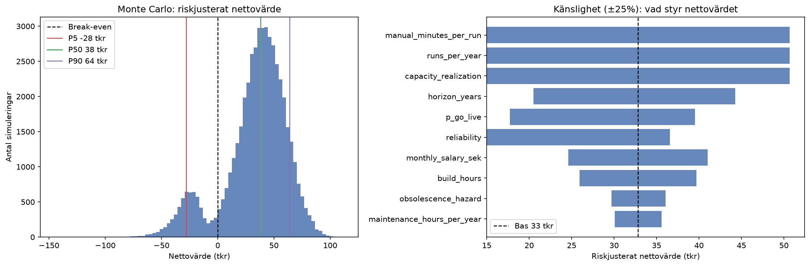

# Automatiseringsbeslut: en riskjusterad kalkyl

[](https://github.com/AntonAlin/automation-value-model/actions/workflows/notebook.yml)

En modell för att avgöra om en manuell rutin är värd att automatisera — i kronor,
med osäkerheten kvantifierad istället för bortgissad.

Frågan dyker upp hela tiden: någon har en manuell rutin, den känns tjatig, och
magkänslan säger att vi borde bygga bort den. Problemet är att magkänslan nästan
alltid räknar fel. Den utgår från att bygget tar exakt så lång tid man gissade, att
automationen funkar felfritt, och att processen lever för evigt. Inget av det stämmer.

Så istället för *"sparad tid är större än byggtid, alltså kör"* svarar modellen på något
mer användbart: **hur sannolikt är det att vi faktiskt tjänar på det, hur mycket i snitt,
och hur mycket riskerar vi om det går snett.**



## Resultat för exempel-caset

En veckorutin på 90 minuter, 40 timmars bygge, 3 års horisont, 55 000 kr/mån:

| Nyckeltal | Värde |
|---|---|
| Riskjusterat nettovärde (deterministiskt) | ~32 800 kr |
| Väntevärde, EMV (Monte Carlo) | ~33 200 kr |
| ROI | ~111 % |
| Sannolikhet lönsam | 88 % |
| Nedsida om det går fel (CVaR) | ~−26 200 kr |
| Break-even | ~47 körningar (~11 mån) |
| **Dom** | **STARK AUTOMATISERA** |

Den vänstra puckeln i histogrammet är inte brus — det är de ~10 % av scenarierna där
bygget aldrig når produktion och hela byggkostnaden är bortkastad.

## De tre stegen

1. **Deterministisk kalkyl.** Sparade timmar minus underhåll minus byggtid, justerat för
   tre saker som brukar glömmas: att framtida tid är mindre värd än tid idag
   (diskontering), att processen kan dö innan horisonten är slut (överlevnad), och att
   bygget kanske aldrig når produktion.
2. **Monte Carlo.** 50 000 scenarier där byggtid, manuell tid, tillförlitlighet och
   livslängd varierar. Ut kommer en fördelning istället för en punkt, vilket gör att man
   kan säga "88 procent chans att det lönar sig" istället för att låtsas veta exakt.
3. **Känslighetsanalys.** Knuffar varje parameter ±25 % och rangordnar vad som faktiskt
   styr utfallet — alltså var det är värt att gräva innan man bestämmer sig.

## Två saker som gör kalkylen ärlig

Det är här de flesta ROI-mallar fuskar, medvetet eller inte.

**Sparad tid blir inte automatiskt pengar.** Om ingen använder den frigjorda tiden till
något som skapar värde är besparingen mest luft. Därför räknas bara en andel av tiden som
riktigt värde (`capacity_realization`, default 0,70).

**Byggtimmen prissätts separat från den sparade timmen.** Sätt
`builder_monthly_salary_sek` så prissätts bygg- och underhållstimmen efter byggarens lön
medan den sparade timmen värderas efter verksamhetens. Det spelar roll: samma case med en
billig process (35 000 kr/mån) och en dyr specialist som bygger (75 000 kr/mån) går från
**+20 900 kr till −7 100 kr** — från självklart ja till nej.

**Timpriset härleds, gissas inte.** Månadslön → fullt belastad timkostnad:

| Steg | Belopp |
|---|---|
| Månadslön | 55 000 kr |
| Årslön (×12) | 660 000 kr |
| + arbetsgivaravgift (31,42 %) | 867 000 kr |
| + overhead (pension, semester, lokaler, IT ~35 %) | 1 171 000 kr |
| ÷ effektiva timmar/år (~1 702 h) | **≈ 690 kr/h** |

Vill man räkna snålare sätter man `overhead_pct=0.0` → ca **510 kr/h**.

## Köra

```bash
pip install -r requirements.txt
jupyter lab projektautomatisering.ipynb
```

Koden i första kodcellen är också körbar rakt av — den har en `__main__`-del som skriver
ut en full rapport för exempel-caset.

```python
case = AutomationCase(
    manual_minutes_per_run=90,   # ärlig tid för hand, per körning
    runs_per_year=52,            # 52 = varje vecka
    build_hours=40,
    monthly_salary_sek=55000,
    capacity_realization=0.70,   # andel sparad tid som FAKTISKT blir värde
)
full_report(case, show_plots=True)
```

## Parametrar

| Parameter | Default | Betydelse |
|---|---|---|
| `manual_minutes_per_run` | — | Manuell tid per körning |
| `runs_per_year` | — | Antal körningar per år |
| `horizon_years` | 3,0 | Hur länge processen antas leva |
| `build_hours` | 40 | Byggtid |
| `maintenance_hours_per_year` | 8 | Underhåll (prissätts som byggtimme) |
| `monthly_salary_sek` | 55 000 | Lön för den som gör jobbet manuellt idag |
| `builder_monthly_salary_sek` | `None` | Byggarens lön; `None` = samma yrkesgrupp |
| `capacity_realization` | 0,70 | Andel sparad tid som blir verkligt värde |
| `p_go_live` | 0,90 | Chans att bygget når produktion |
| `reliability` | 0,95 | Andel körningar som görs rätt |
| `obsolescence_hazard` | 0,10 | Årlig risk att processen dör/byts ut |
| `discount_rate` | 0,05 | Tidsvärde på framtida kronor |

De två som flyttar utfallet mest är `capacity_realization` och overhead-påslaget i
timpriset, så det är dem man ska vara noga med.

## KPI-uppföljning

Sista delen av notebooken är en enkel vy för att följa upp automationer i drift: antal
i drift, sparade timmar, netto besparing, snitt-payback och hur stor andel som lever
vidare. Sannolikheter och riskintervall är medvetet bortplockade där — de hör hemma i
beslutsunderlaget, inte i en ledningsrapport.

## Där modellen förenklar

Den drar alla osäkra parametrar **oberoende** av varandra. I verkligheten hänger ett
struligt bygge ihop med både mer underhåll och högre risk att det aldrig når produktion,
vilket gör den verkliga nedsidan i svansen något tjockare än siffrorna visar. Bra att ha
i bakhuvudet innan man lutar sig för hårt mot exakt hur illa det kan gå.

## Bakgrund

Idén att sätta kronor på sådant som känns svårmätt kommer från Douglas Hubbards
*How to Measure Anything* och metoden Applied Information Economics. Att byggestimat
systematiskt lutar mot underskattning — därav den lognormala byggtiden med fet svans
uppåt — är väl dokumenterat hos Magne Jørgensen.

## Licens

MIT, se [LICENSE](LICENSE).
